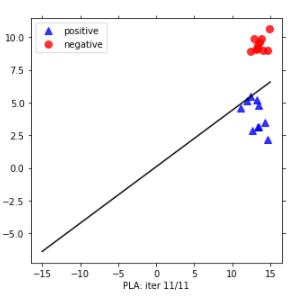
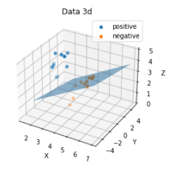

# Perceptron-visualize-2d-and-3d
Check out my 2 YOUTUBE channels for more:
1. [Mrzaizai2k - AI](https://www.youtube.com/channel/UCFGCVG0P2eLS5jkDaE0vSfA) (NEW)
2. [Mrzaizai2k](https://www.youtube.com/channel/UCCq3lQ1W437euT9eq2_26HQ) (old)

Here I create a file that using perceptron to classify linearly separable dataset on 2d and 3d space

You can find my kaggle notebook [**HERE**](https://www.kaggle.com/bomaich/perceptron-visualize#PERCEPTRON) for more information

You can you file '.py' to visualize it
or file 'perceptron-visualize.ipynb' on google colab, jupyter notebook or kaggle

<i>Figure 1. Result with 2d data </i>

<i>Figure 1. Result with 3d data </i>

